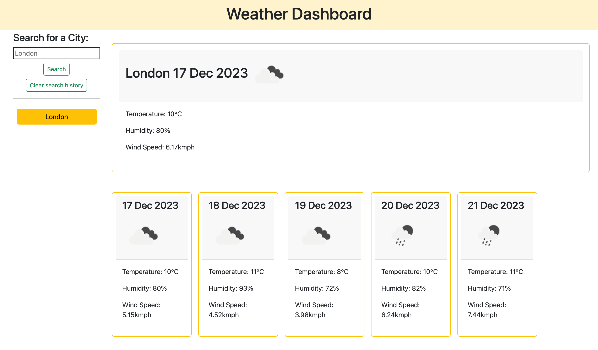

# Weather Dashboard
## Description

This application is weather dashboard, so the user can check weather conditions to wear approperiate cloths or plan events. This app runs in the browser, and features dynamically updated HTML and CSS powered by JavaScript.

API used: [Weather Forecast](https://openweathermap.org/forecast5)

## Installation

This app runs in the browser, and features dynamically updated HTML and CSS powered by JavaScript.

To access weather dashboard [follow the link](https://porlowska.github.io/weather-dashboard/). 

Then type city you are interested in and press search!

## Usage

This app can be used any individual who would like to check weather conditions to wear approperiate cloths or plan events.

## Credits

N/A

## License

MIT Licence
